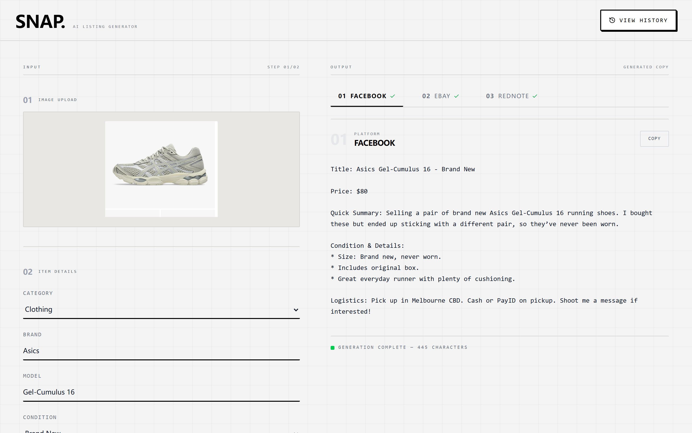
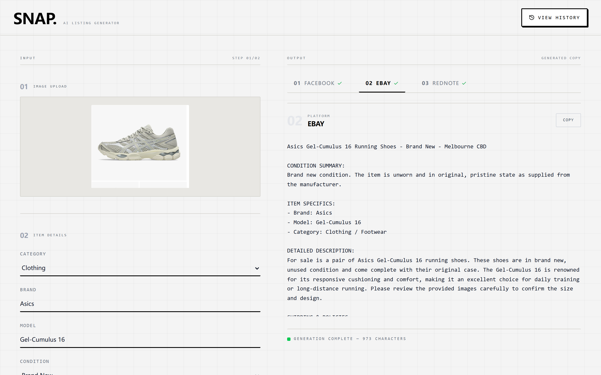
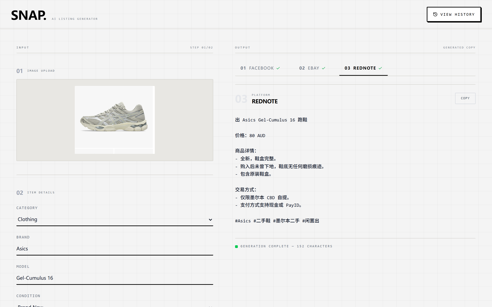
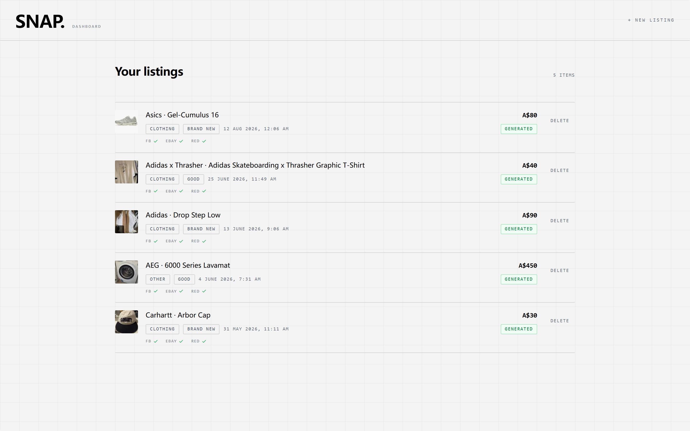
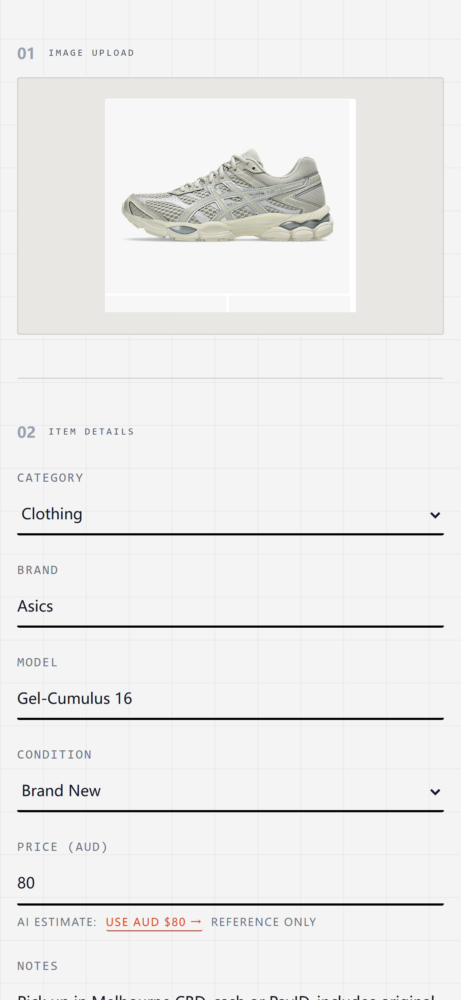
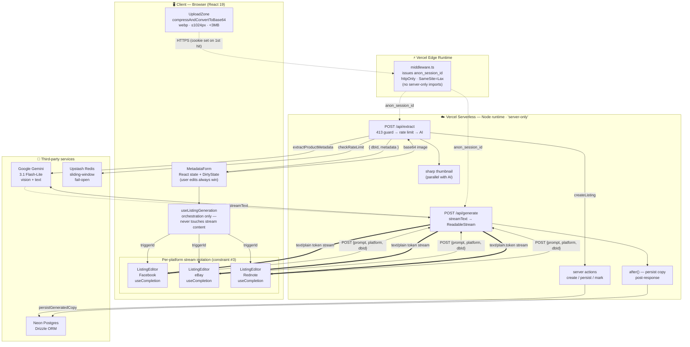
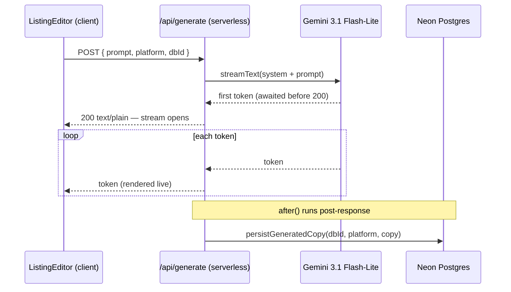

# Snaplist

[](https://github.com/Kiezzzx/snaplist/actions/workflows/playwright.yml)

AI-powered second-hand listing generator. Upload a photo, get platform-specific listing copy for **Facebook Marketplace**, **eBay**, and **Rednote** — written in the right tone, in the right language.

**▶ [Try the live demo](https://snaplist-theta.vercel.app)** — no sign-up, just upload a photo.



---

## One photo, three platforms

Each platform has its own system prompt tuned to that marketplace's conventions —
conversational English for Facebook, structured SEO for eBay, concise Mandarin for
Rednote. All three stream **in parallel**, each in its own isolated state, so one
platform failing never poisons the others.

**eBay** — SEO title, item specifics, and a dispute-proof condition summary:



**Rednote (小红书)** — the same item in Simplified Chinese: concise, factual, and
deliberately free of influencer filler:



## Listing history

Every generation is persisted to Postgres and scoped to your anonymous session —
no login required.



Each listing keeps its reviewed metadata and all three generated copies, viewable
from a detail page.

## Responsive

The two-column desktop layout collapses to a single stacked column on mobile, with
the platform tabs becoming horizontally scrollable.



---

## Tech stack

| Layer | Choice |
|---|---|
| Framework | **Next.js 16** (App Router) + **React 19** |
| Language | **TypeScript**, strict mode |
| Styling | **Tailwind CSS v4** + shadcn/ui |
| AI | **Vercel AI SDK** + **Google Gemini 3.1 Flash-Lite** (vision + text) |
| Database | **Neon Postgres** + **Drizzle ORM** |
| Rate limiting | **Upstash Redis** — sliding window, fail-open |
| Validation | **Zod** — one schema per boundary, types derived via `z.infer` |
| Testing | **Vitest** (unit) + **Playwright** (e2e), run in GitHub Actions |

## Engineering highlights

The interesting parts of this project aren't the CRUD — they're the failure paths.

- **Streaming errors surface as real HTTP status codes.** `/api/generate` awaits the
  first token *before* committing to `200`, so a Gemini `429`/`503` returns a proper
  error status instead of a truncated success. If a stream dies mid-flight — after
  `200` is already sent and the status can no longer change — it appends a visible
  sentinel rather than silently truncating and labelling partial copy "complete".
- **Fail-open rate limiting.** If Upstash is slow or unreachable, `checkRateLimit`
  resolves as *allowed*. A limiter outage must never take down a core upload; the
  guard is protective, not load-bearing. Unit-tested for both the throwing and the
  unconfigured case.
- **User edits always win.** `DirtyState` marks every field the user has touched, so
  a late `/api/extract` response can never overwrite something they typed.
- **Per-platform stream isolation.** Each `<ListingEditor>` owns its own stream.
  `useListingGeneration` coordinates lifecycle (restart signal, aggregate status)
  but never reads or writes stream content — so one platform failing or being
  aborted cannot poison its siblings.
- **Secrets are excluded at compile time, not by convention.** The Gemini key, Neon
  client, and Upstash client all sit behind `'server-only'`. The Edge middleware
  duplicates the session-cookie name as a literal instead of importing it, keeping
  the Node-only module graph out of the Edge bundle.
- **Concurrent writes merge atomically.** Three parallel platform writes target the
  same row, so `persistGeneratedCopy` merges with
  `COALESCE(...) || fragment::jsonb` inside the row lock — no read-modify-write
  window where one platform's copy overwrites another's.
- **Reads re-validate at the boundary.** Drizzle's `$type<>` is compile-time only, so
  both dashboard pages `safeParse` JSONB through shared Zod schemas; a historical row
  with a drifted shape degrades gracefully instead of crashing the render.

---

## How it works

```
┌───────────┐    ┌──────────────┐    ┌─────────────┐    ┌──────────┐
│ 1. UPLOAD │ -> │ 2. EXTRACT   │ -> │ 3. REVIEW   │ -> │ 4. GEN   │
│  photo    │    │  Gemini Vision│    │  edit form  │    │  stream  │
└───────────┘    └──────────────┘    └─────────────┘    └──────────┘
   compress         /api/extract        DirtyState        /api/generate
   <3MB             returns JSON        user wins         parallel streams
```

1. **Upload** — Image compressed client-side to <3MB (max 1024px edge, webp).
2. **Extract** — Gemini 3.1 Flash-Lite returns category, brand, model, condition, suggested AUD price, notes.
3. **Review** — User edits the AI-prefilled form. Edits are sticky; late AI responses never overwrite user input (`DirtyState`).
4. **Generate** — Three parallel text streams (`text/plain`) produce platform-specific copy with isolated state per tab.

## Architecture

Snaplist runs entirely on Vercel's platform, split across three runtime tiers — the
**browser**, the **Edge runtime**, and the **Node serverless runtime** — with all
paid/stateful dependencies (Gemini, Upstash, Neon) kept strictly behind the
serverless boundary. Nothing that holds a secret or a DB handle is ever reachable
from the client.



### Streaming lifecycle (`/api/generate`)

The generate route deliberately **awaits the first token before committing to
HTTP 200**, so a Gemini `429`/`503` surfaces as a real error status instead of a
truncated 200. Persistence happens *after* the client has the full stream, via
`after()`, and is skipped on mid-stream failure so partial copy never gets saved
as "the listing".



### Data-flow boundaries & isolation

The diagram's tiers are enforced boundaries, not just visual grouping:

- **Client → network (compression boundary).** Images are compressed to webp
  (≤1024px, `<3MB`) *in the browser* before they ever hit the wire; the server
  re-checks and rejects anything over 4.5MB with a `413` before spending Sharp or
  Gemini cycles.
- **Edge ↔ serverless.** `middleware.ts` runs on the Edge runtime and issues the
  `anon_session_id` cookie for every visitor. It **cannot import the `server-only`
  module graph** (DB, AI, session), so the cookie name is duplicated as a literal
  rather than imported — this keeps the Edge bundle free of Node-only code.
- **`server-only` secret boundary.** The Gemini key, Neon connection, and Upstash
  client all live in modules marked `'server-only'`, so they are never bundled into
  client code. The browser only ever sees JSON metadata and token text.
- **Per-platform stream isolation (constraint #3, #5).** Each `<ListingEditor>`
  owns its own `useCompletion` stream. `useListingGeneration` coordinates lifecycle
  (a `triggerId` restart signal + an aggregate status map) but **never reads or
  writes stream content** — so one platform failing or being aborted can't poison
  the copy of its siblings.
- **Fail-open rate limiting.** Upstash is consulted *after* the cheap local guards
  but *before* Gemini. If Redis is slow or down, the limiter resolves as *allowed* —
  a rate-limiter outage must never take down a core upload.

## Getting started

```bash
npm install
cp .env.example .env.local   # fill in the keys below
npm run dev
```

Open [http://localhost:3000](http://localhost:3000).

### Environment variables

| Key | Required | Purpose |
|-----|----------|---------|
| `GOOGLE_GENERATIVE_AI_API_KEY` | yes | Gemini 3.1 Flash-Lite for both extract + generate |
| `DATABASE_URL` | yes | Neon Postgres connection (listings + dashboard) |
| `UPSTASH_REDIS_REST_URL` | no | Rate limiting; blank = disabled (fail-open) |
| `UPSTASH_REDIS_REST_TOKEN` | no | Rate limiting; blank = disabled (fail-open) |

## Project layout

```
src/
├── app/
│   ├── page.tsx                    # main UI (upload → review → generate)
│   ├── dashboard/                  # listing history + detail pages
│   ├── api/
│   │   ├── extract/route.ts        # image -> structured metadata
│   │   └── generate/route.ts       # metadata -> text/plain listing stream
│   └── globals.css                 # brutalist design tokens
├── components/
│   ├── listings/                   # upload-zone, metadata-form, listing-editor
│   └── dashboard/                  # listing-platform-tabs, delete-button
├── hooks/
│   └── use-listing-generation.ts   # cross-platform generation orchestration
└── lib/
    ├── platforms.ts                # PLATFORMS order + PLATFORM_META (single source)
    ├── types.ts                    # ProductMetadata, DirtyState, Platform
    ├── ai/                         # extract-metadata, generate-listing (prompts)
    ├── db/                         # Drizzle schema, validators, client
    ├── actions/                    # listings server actions (create/persist/delete)
    ├── ratelimit.ts                # Upstash fail-open limiter
    ├── session.ts                  # anonymous session cookie
    └── utils/compress-image.ts     # browser-image-compression wrapper
```

## API

### `POST /api/extract`

```ts
// Request
{ imageBase64: string }

// Response
{ success: true, dbId: string, metadata: Partial<ProductMetadata> }
// or
{ success: false, error: string, code?: 'RATE_LIMIT' | 'AI_BUSY' }
```

Returns **413** if payload exceeds 4.5MB, **429** on daily rate limit (`RATE_LIMIT`) or transient Gemini quota (`AI_BUSY`).

### `POST /api/generate`

```ts
// Request — the client serializes the reviewed metadata into `prompt`
{ prompt: string, platform: 'Facebook' | 'eBay' | 'Rednote', dbId: string }

// Response
text/plain — token-by-token listing copy (consumed with streamProtocol: 'text')
```

Each platform has its own system prompt tuned for tone (conversational English for Facebook, structured SEO for eBay, casual Mandarin for Rednote). On stream completion the copy is persisted back to the listing row.

## Design constraints

These are load-bearing; don't violate them:

1. **Compression before upload** — payload must be <3MB.
2. **Dirty state** — never overwrite a field the user has typed in, even if `/api/extract` resolves late.
3. **Streaming isolation** — stream state stays local to `<ListingEditor>`. No hoisting to parent or global store.
4. **AbortController** — every generate fetch is abortable. Cancel on regenerate or unmount.
5. **Per-platform error isolation** — one platform failing doesn't poison the others.
6. **413 enforcement** — `/api/extract` rejects payloads >4.5MB before calling the model.

## Scripts

```bash
npm run dev         # dev server
npm run build       # production build
npm run start       # serve production build
npm run lint        # eslint
npm test            # vitest unit tests (run once)
npm run test:watch  # vitest in watch mode
npx playwright test # end-to-end tests (Chromium)
```

## Testing & CI

- **Unit** — [Vitest](https://vitest.dev) (`happy-dom`), specs in `tests/**/*.test.ts`. Covers platform config, validators, and the fail-open rate limiter.
- **E2E** — [Playwright](https://playwright.dev) (Chromium), specs in `tests/**/*.spec.ts`. These drive the real app and make **live Gemini calls**; the dev server runs with Upstash creds blanked so the suite's uploads aren't blocked by the anonymous rate cap.

CI runs on GitHub Actions (`.github/workflows/playwright.yml`) for every push and PR to `master`, in three sequential jobs:

```
type-and-lint  ->  unit-tests  ->  e2e-tests
tsc + eslint       vitest run      playwright (Chromium)
```

The e2e job needs `DATABASE_URL` and `GOOGLE_GENERATIVE_AI_API_KEY` configured as repository secrets.

## Deployment

Deploy to Vercel. Set `GOOGLE_GENERATIVE_AI_API_KEY` in project env vars.

## Status & roadmap

**Working today** — single-image upload, Gemini Vision extraction, parallel
three-platform generation with live streaming, Postgres persistence, and an
anonymous-session dashboard (history, detail view, delete).

Known trade-offs, made deliberately to ship an MVP:

| Next up | Why it's not done yet |
|---|---|
| **Cloudflare R2 object storage** | Thumbnails are currently inline base64 in Postgres — a knowingly temporary placeholder. The `originalImageKey` / `thumbnailKey` columns and the two-phase delete (R2 objects before the DB row, so a failed delete can't orphan billable objects) are already stubbed for the cutover. |
| **Auth.js (OAuth) + anonymous claim** | Anonymous sessions work end to end; signing in should migrate a visitor's existing listings to their user id. The authenticated 20/day rate-limit tier is already implemented but currently unreachable. |
| **Structured logging & error reporting** | Server errors go to `console.error` only — fine for a demo, not for production triage. |
| **Deterministic e2e** | The Playwright suite makes live Gemini calls, which makes CI slower and occasionally flaky on model quota. |
